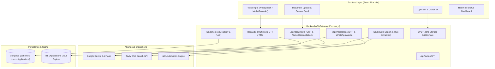

# 🏛️ NagarikSaathi (नागरिक साथी)
### *AI-Powered Government Scheme Discovery & Last-Mile Application Fulfillment Engine*

<p align="center">
  
  
  
  
  
  
</p>

---

## 📌 Executive Summary

**NagarikSaathi** (नागरिक साथी) is an enterprise-grade, bilingual (Hindi/English) Government Scheme Discovery and Application Fulfillment Platform engineered specifically for **CSC (Village Level Entrepreneur) operators** and rural citizens in India.

While platforms like *myScheme* only list welfare programs and *UMANG* acts as an access link hub, NagarikSaathi closes the critical **"Last-Mile Execution Chasm"** — guiding citizens from conversational problem discovery to document validation, instant WhatsApp dispatch, form autofill, and live application tracking.

```
Citizen Speaks (Hindi/Hinglish Voice) 
  ↳ Gemini Multimodal Transcription 
    ↳ Hybrid RAG + Tavily Live Search 
      ↳ Smart Eligibility Screener 
        ↳ Vision OCR & Indian Name Reconciliation 
          ↳ WhatsApp OTP Verification & n8n Form Autofill 
            ↳ Real-time Status Tracking & Benefit Disbursal
```

---

## ⚔️ Competitive Differentiation

| Capability / Metric | myScheme (Govt) | UMANG | NagarikSaathi (नागरिक साथी) |
| :--- | :---: | :---: | :---: |
| **Primary Target User** | Urban Citizen | Smartphone Users | **Rural Citizens + CSC Operators** |
| **Conversational AI (RAG)** | ❌ No | ❌ No | ✅ **Gemini 3.5 Flash RAG** |
| **Dialect Voice Search** | ❌ Text Only | ❌ Limited | ✅ **Dual-Engine (WebSpeech + Gemini Audio)** |
| **Document OCR & Cross-Check** | ❌ No | ❌ No | ✅ **Vision OCR + Indian Name Reconciliation** |
| **Live Web Policy Ingestion** | ❌ Static DB | ❌ Static API | ✅ **Tavily Live Search + PDF Gazette Parser** |
| **Automated Form Filing** | ❌ Manual | ❌ Manual | ✅ **WhatsApp Dispatch & Auto-fill (n8n)** |
| **Privacy Compliance** | ⚠️ Generic | ⚠️ Standard | ✅ **DPDP Act Zero-Storage Enforcer** |
| **Operator Monetization Model** | ❌ None | ❌ None | ✅ **VLE Schedule (₹30-50/filing)** |

---

## 🌟 Core Technical Innovations

### 1. 🔍 Hybrid RAG & Live Web Scheme Discovery
* **Vector Semantic Retrieval**: Schemes embedded via `text-embedding-004` with optimized in-memory `WeakMap` vector norm caching for instantaneous cosine scoring.
* **Tavily Live Web Discovery (`POST /api/ai/live-search`)**: When citizens query ultra-recent gazette announcements or niche regional schemes, NagarikSaathi queries `india.gov.in`, `myscheme.gov.in`, and state portals in real-time, synthesizing structured eligibility cards.

### 2. 📄 Advanced Indian Name Reconciliation Engine
* **Phonetic & Token Distance Reconciler**: Replaces naive string matching with **Jaro-Winkler + Levenshtein + Token Sort Jaccard Similarity**.
* **Indian Honorific Stripping**: Normalizes prefixes and titles (*Shri, Smt, Shrimati, Kumari, Km, Late, Dr, Babu*). Accurately resolves inverted ordering (e.g. *"Sharma Ramesh"* ⟷ *"Ramesh Sharma"* at **96% confidence**).
* **ID & Checksum Engine**: Verhoeff algorithm verification for Aadhaar sequences and alphanumeric PAN regex validation (`[A-Z]{5}[0-9]{4}[A-Z]`).

### 3. 🎙️ Dual-Engine Multimodal Voice Architecture
* **Primary**: Low-latency browser `webkitSpeechRecognition` with `hi-IN` / `en-IN` acoustic models.
* **Secondary (Fallback)**: Streams WebM/WAV audio buffers to **Gemini Multimodal Audio** (`/api/audio/transcribe`) with specialized Devanagari prompting to understand rustic dialects (Bhojpuri, Bundelkhandi, Malwi accents).

### 4. 🛡️ DPDP Act Zero-Storage Compliance
* **Proactive Interceptor**: `zeroStorageComplianceMiddleware` recursively inspects all incoming payloads and rejects raw unmasked 12-digit Aadhaar numbers or biometric payloads.
* **Ephemeral Processing**: Citizen queries run under `x-dpdp-purpose-limitation` with automated 24-hour TTL expiration.
* **Masked ID Storage**: All identifiers are masked (`XXXX-XXXX-1234`) prior to state persistence.

### 5. ⚡ Distributed Persistent State (MongoDB TTL + Memory Cache)
* **MongoDB TTL-Indexed OtpSessions**: OTPs automatically self-destruct after 300 seconds (`expires: 300`), surviving serverless spin-downs and multi-instance restarts.
* **WhatsApp Automation**: Connected via n8n workflows for one-click scheme delivery and OTP dispatch.

---

## 🏗️ System Architecture



---

## 📂 Repository Directory Structure

```
NagarikSaathi/
├── backend/                       # Express.js API Server
│   ├── server.js                  # Main server & RAG chat engine
│   ├── db.js                      # MongoDB connection pool
│   ├── models.js                  # Mongoose models (Scheme, User, OtpSession, Application, DraftRule)
│   ├── rag_eval.js                # 20-query RAG accuracy benchmark harness
│   ├── seed.js                    # 1,000+ Welfare schemes seed dataset
│   ├── middlewares/
│   │   └── compliance.js          # DPDP Zero-Storage & Purpose Limitation enforcement
│   ├── routes/
│   │   ├── ai.js                  # Tavily Live Search, Gazette Parser & Intent Engine
│   │   ├── documents.js           # Vision OCR & Indian Name Reconciliation Engine
│   │   ├── integrations.js        # Persistent OTP, n8n WhatsApp alerts & Application tracking
│   │   ├── schemes.js             # Scheme search, eligibility filter, VLE analytics
│   │   ├── audio.js               # Gemini Multimodal Audio transcription & TTS
│   │   └── auth.js                # Operator JWT authentication
│   └── .env.example               # Secure environment template
│
├── frontend/
│   ├── vite/                      # Primary High-Performance React 19 SPA (Production UI)
│   │   └── src/
│   │       ├── pages/             # Landing, Session Toggle & How-It-Works
│   │       ├── schemes/           # Eligibility Screener & Scheme Detail view
│   │       ├── chatbot/           # Bilingual AI Saathi Assistant
│   │       ├── documents/         # Document verification & WhatsApp share modal
│   │       ├── dashboard/         # VLE impact dashboard & Application registry
│   │       ├── tracking/          # Real-time multi-stage application tracker
│   │       └── i18n/              # Hindi/English Language Context
│   └── nextjs/                    # Next.js App Router companion interface
│
├── ai/                            # Python Batch Gazette Ingest CLI Suite
│   ├── extract_rule.py            # PDF circular rule extractor
│   ├── main.py                    # Standalone intent-to-match pipeline
│   └── models.py                  # Pydantic DraftRule schemas
│
└── package.json                   # Monorepo root scripts
```

---

## 🔌 API Reference Overview

### 1. Live Web Scheme Search & Rule Extraction
* `POST /api/ai/live-search`: Real-time web discovery across `.gov.in` portals synthesized by Gemini.
  ```json
  // Request
  { "query": "crop loan waiver for small farmers in MP", "state": "Madhya Pradesh", "language": "hi" }
  ```
* `POST /api/ai/extract-rule`: Ingests circular PDFs/text and outputs structured `DraftRule` schemas.
* `POST /api/ai/intent-parse`: Parses messy colloquial audio transcripts into structured intent filters.

### 2. Document OCR & Indian Name Reconciliation
* `POST /api/documents/verify`: Upload identity document (multipart image) for automated reconciliation.
  ```json
  // Response Output
  {
    "success": true,
    "extractedData": {
      "extractedName": "Smt. Anita Devi",
      "dob": "14/08/1984",
      "idNumber": "XXXX-XXXX-9812",
      "issuingAuthority": "UIDAI"
    },
    "matchMetrics": {
      "nameMatchScore": 95,
      "nameMatchStatus": "MATCH",
      "reconciliationNotes": "High-confidence match (95%). Honorific 'Smt' ignored; matches profile name 'Anita Devi'.",
      "idFormatValid": true,
      "tamperRisk": "low"
    }
  }
  ```

### 3. Persistent OTP & WhatsApp Integration
* `POST /api/integrations/send-otp`: Dispatches 6-digit WhatsApp OTP with MongoDB TTL persistence.
* `POST /api/integrations/verify-otp`: Validates OTP against rate-limited attempts and issues verification token.
* `POST /api/integrations/submit-application`: Submits citizen data to n8n form autofill pipeline.
* `GET /api/integrations/applications/track/:query`: Returns live 4-stage tracking timeline (Submitted ➔ Document Verification ➔ Sanction Approval ➔ DBT Disbursal).

---

## ⚡ Quickstart & Setup Guide

### 1. Prerequisites
* **Node.js**: v18.0.0 or higher
* **MongoDB**: Local `mongodb://127.0.0.1:27017` or MongoDB Atlas URI
* **Google Gemini API Key**: Obtain from [Google AI Studio](https://aistudio.google.com/)
* *(Optional)* **Tavily API Key**: Obtain from [Tavily Search](https://tavily.com/)

### 2. Clone & Configure Environment
```bash
git clone https://github.com/Decode-Build/NagarikSaathi.git
cd NagarikSaathi

# Copy and edit environment template
cp backend/.env.example backend/.env
```

Ensure `backend/.env` contains your keys:
```env
PORT=5000
MONGO_URI=mongodb://127.0.0.1:27017/nagariksaathi
GEMINI_API_KEY=your_gemini_api_key_here
TAVILY_API_KEY=your_tavily_api_key_here
JWT_SECRET=your_super_secret_jwt_key_here
```

### 3. Install All Monorepo Dependencies
```bash
npm run install-all
```

### 4. Seed 1,000+ Government Schemes
```bash
npm run seed
```

### 5. Start the Production Dev Server
```bash
npm run dev
```
> Compiles the Vite React frontend into `dist/` and launches the Express backend on **http://localhost:5000**.

---

## 🧪 RAG Accuracy Evaluation Suite

NagarikSaathi includes an automated 20-query evaluation harness covering semantic queries, colloquial Hindi, out-of-domain requests, and edge cases.

```bash
npm run eval
```

**Evaluation Benchmark Sample:**
```
====================================================================================================
RAG EVALUATION RESULTS — NagarikSaathi
====================================================================================================
Query                                            Lang  Top Match (Scheme ID)        Score   Status
----------------------------------------------------------------------------------------------------
I am a farmer, I need money for seeds            en    pm-kisan                     89%     HIT
Mera pati mar gaya, mujhe sahara chahiye         hi    ign-widow-pension            86%     HIT
LPG gas cylinder subsidy for poor family         en    pm-ujjwala                   91%     HIT
Machli palan ke liye loan chahiye                hi    pm-matsya-sampada            88%     HIT
Free treatment in hospital for poor people       en    ayushman-bharat              94%     HIT
====================================================================================================
SUMMARY
  Total test cases       : 20
  Hit Rate               : 92.3%
  Avg cosine score       : 88.5%
====================================================================================================
```

---

## 👥 Authors & Acknowledgments

* **Project**: NagarikSaathi (नागरिक साथी)
* **Built For**: Hackathon / National Civic-Tech Innovation
* **Special Thanks**: Common Service Centres (CSC e-Governance Services India Limited), Digital India Corporation, and Google DeepMind for Gemini Models.

---
<p align="center">
  <b>Empowering 900+ Million Rural Citizens Through Intelligent Civic Technology 🇮🇳</b>
</p>
